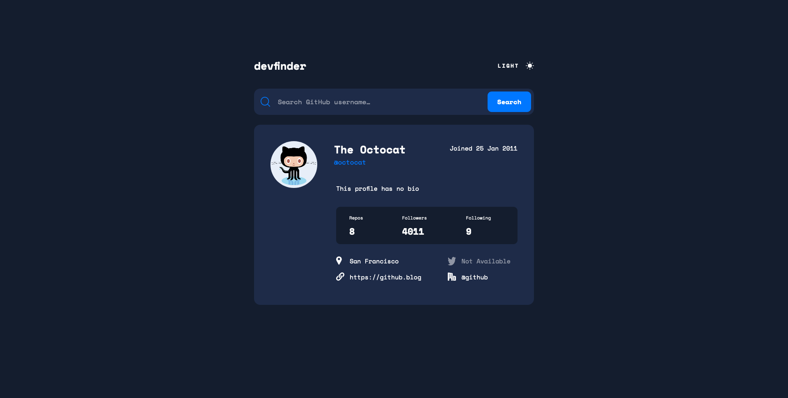

# GitHub user search app

FrontEnd Mentor Challenge

# Welcome ! 👋

### Screenshot

## Avalaible scripts

In the project director, you can run :

### `npm install`

### `yarn start`

## My process

### Built with :

- CSS custom properties
- Mobile first workflow
- Fetch API (Github API)
- [Dark Mode React Js](https://github.com/gustavo-gomez/dark-mode-reactJs)
- [React](https://fr.reactjs.org/)

### What I learned

The fetching from the API part wasn't so hard, but I got a lot of problems dispatching the data in other components.

I had fun working with the switch theme mode and using css custom properties.
The link of the repo who helped me with the switch theme mode is in the section above.

## Author

- Frontend Mentor - [@Alexandre-st](https://www.frontendmentor.io/profile/Alexandre-st)
- Twitter - [@a_saintprix](https://twitter.com/a_saintprix)
